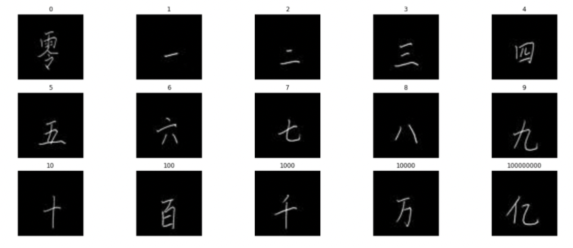

# RCode
Some projects, tasks and tests written in R. Both uni projects and personal projects included.

## :pushpin: Linear Regression, Confidence Intervals and t-Tests
**Code:** [LinReg_CI_tTest.R](https://github.com/xiancaicai/RCode/blob/main/LinReg_CI_tTest.R)

Without external packages wrote functions which execute **linear regression**, compute **confidence intervals** and **t-Tests (both classical and stratified)**, to understand how the math works behind the built-in functions so-often used. Homework coded with reference to course material.

## :pushpin: Frequentist vs Bayesian estimation
**Code:** [ResDev_IRLS_Boots_MCMC.R](https://github.com/xiancaicai/RCode/blob/main/ResDev_IRLS_Boots_MCMC.R)

Without external packages wrote functions to calculate **Residual Deviance**, perform **Iteratively Reweighted Least Squares**, **Monte Carlo Metropolis Hastings** simulations, **Bootstrap** sampling and estimation. Homework coded with reference to course material.

## :pushpin: Supervised Learning (Classification) with Multilayer Neural Networks
**Code:** [ChineseMNIST_NN.R](https://github.com/xiancaicai/RCode/blob/main/ChineseMNIST_NN.R)

**Packages used: Keras, Magick, Tidyverse.**

Compared optimization algorithms used in classification with multilayer neural networks (nonlinear statistical models). The models were trained to classify Chinese number characters (a subset of the 'Chinese MNIST' data set from the University of Newcastle available [here](https://data.ncl.ac.uk/articles/dataset/Handwritten_Chinese_Numbers/10280831/1)) using three different optimization algorithms: classic Stochastic Gradient Descent (SGD), ADAM and RMSprop. 
